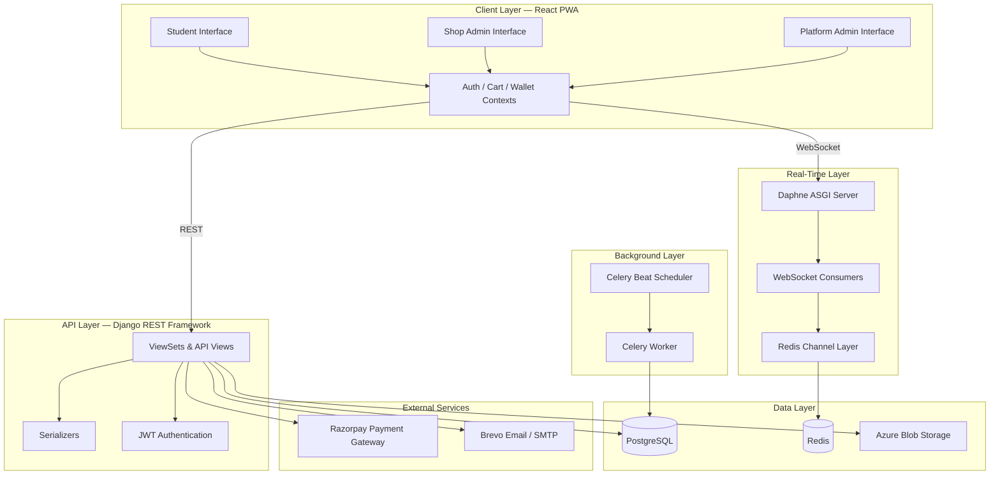
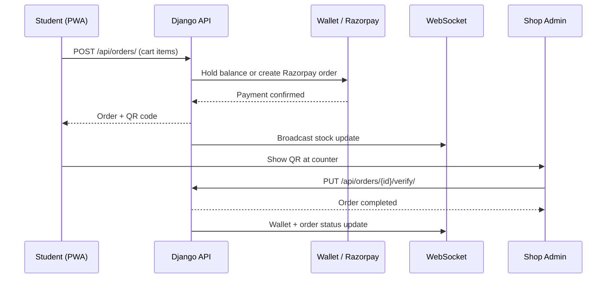

# 🍽️ BiteMePlz (REC-KIOSK)

### Smart Campus Food Ordering & Digital Wallet Platform

_Order online. Pay digitally. Skip the queue._

React 18 · TypeScript · Django 4.2 · PostgreSQL · Redis · Docker

---

## 📖 Table of Contents

1. [🌟 Executive Summary](#-executive-summary)
2. [🎯 Core Capabilities](#-core-capabilities)
3. [🏗 System Architecture](#-system-architecture)
   - 3.1 [Layered Architecture Overview](#31-layered-architecture-overview)
   - 3.2 [Request & Data Flow](#32-request--data-flow)
   - 3.3 [Real-Time Communication](#33-real-time-communication)
   - 3.4 [Background Processing](#34-background-processing)
4. [👥 Role-Based Access Model](#-role-based-access-model)
5. [🛒 Order Lifecycle & Wallet Mechanics](#-order-lifecycle--wallet-mechanics)
   - 5.1 [Order States](#51-order-states)
   - 5.2 [Digital Wallet & Held Amounts](#52-digital-wallet--held-amounts)
   - 5.3 [QR Verification Flow](#53-qr-verification-flow)
6. [🏪 Shop & Inventory Management](#-shop--inventory-management)
7. [💳 Payment Integration — Razorpay](#-payment-integration--razorpay)
8. [🔐 Authentication & Security](#-authentication--security)
9. [📊 Analytics & Activity Logging](#-analytics--activity-logging)
10. [📁 Project Structure](#-project-structure)
11. [📈 Key Interaction Flows](#-key-interaction-flows)
    - 11.1 [Student Order Placement](#111-student-order-placement)
    - 11.2 [Shop Admin QR Verification](#112-shop-admin-qr-verification)
12. [🛠 Setup & Development Guide](#-setup--development-guide)
    - 12.1 [Prerequisites](#121-prerequisites)
    - 12.2 [Local Development (Without Docker)](#122-local-development-without-docker)
    - 12.3 [Docker Deployment](#123-docker-deployment)
    - 12.4 [Environment Variables Reference](#124-environment-variables-reference)
    - 12.5 [Management Commands](#125-management-commands)
13. [⚠️ Known Limitations](#️-known-limitations)
14. [🗺 Future Roadmap](#-future-roadmap)
15. [📚 Third-Party Dependencies](#-third-party-dependencies)

---

## 🌟 Executive Summary

**BiteMePlz** (REC-KIOSK) is a full-stack, real-time campus food ordering and digital wallet platform built for a college ecosystem. It enables students and staff to browse on-campus shops, place orders, pay via an integrated wallet or Razorpay, and collect food using QR-code-based verification — eliminating long queues and cash handling at campus canteens and kiosks.

The platform is engineered around three core pillars:

- **Speed** — Mobile-first Progressive Web App (PWA) with real-time stock updates and instant order status via SSE (Server-Sent Events) with automatic polling fallback.
- **Trust** — Time-limited QR codes, held-amount wallet mechanics, and OTP-verified accounts ensure secure, auditable transactions.
- **Control** — Granular role-based dashboards for students, shop admins, sub-admins, and platform administrators with analytics and activity logging.

BiteMePlz is purpose-built for:

- 🏫 College and university campus canteens
- 🏪 Multi-vendor kiosk ecosystems
- 👨‍🎓 Student and staff digital wallet programs
- 📊 Campus administration with financial reporting and behavioral analytics

> **Version:** 1.0 — **Classification:** Production Campus Deployment

---

## 🎯 Core Capabilities

| Capability | Technology | Scope |
| --- | --- | --- |
| Food Ordering | React PWA + DRF REST API | Multi-shop, categorized menus |
| Digital Wallet | Django ORM + held-amount logic | Balance, top-up, refunds, forfeiture |
| Online Payments | Razorpay SDK | Wallet top-up and order payment |
| QR Pickup Verification | `react-qr-code` + `html5-qrcode` | Time-limited, shop-configurable validity |
| Real-Time Updates | Django Channels + Redis | Live stock, wallet balance, order status |
| Background Jobs | Celery + Celery Beat | Order expiry, shop auto open/close |
| Authentication | SimpleJWT + OTP email | Registration, login, password reset |
| Media Storage | Azure Blob Storage / local | Product images, shop assets |
| Analytics | Recharts + Chart.js | Student spending, shop revenue dashboards |
| Activity Logging | `StudentLog` model | Login, cart, order, and profile events |
| Access Control | Role-based + sub-admin hierarchy | Admin, shop admin, sub-admin, student, staff |
| Containerization | Docker + Docker Compose | Nginx frontend, Supervisord backend |

---

## 🏗 System Architecture

BiteMePlz follows a decoupled client–server architecture. The React frontend communicates with a Django REST API over HTTPS, with a single multiplexed SSE stream for real-time events (and polling fallback), plus Celery workers for asynchronous background processing.



### 3.1 Layered Architecture Overview

| Layer | Components & Responsibilities |
| --- | --- |
| **Client (PWA)** | React 18, TypeScript, Vite, Tailwind CSS, React Router, role-specific layouts |
| **API** | Django REST Framework ViewSets, custom auth views, serializers, middleware |
| **Real-Time** | SSE stream (`/api/events/stream/`), Redis pub/sub event bus, polling fallback |
| **Background** | Celery tasks for order expiry, shop hours, wallet notifications |
| **Persistence** | PostgreSQL (users, shops, products, orders, transactions, logs) |
| **Cache / Messaging** | Redis (Celery broker, Channels layer in production) |
| **Media** | Azure Blob Storage (production) or local `media/` (development) |
| **Infrastructure** | Docker, Nginx, Supervisord (Daphne + Celery + Redis) |

### 3.2 Request & Data Flow

REST requests from the frontend carry a JWT access token in the `Authorization` header. ViewSets validate permissions based on user role, execute business logic (stock deduction, wallet holds, QR generation), and return serialized JSON responses.

```
User Action (UI)
    │
    └── React Context / Axios
            │
            └── Django REST API (JWT Auth)
                    │                   │
                 PostgreSQL          Celery Task Queue
                    │                   │
              Azure Blob            Redis Broker
```

### 3.3 Real-Time Communication

The app uses **SSE (Server-Sent Events)** as the primary real-time transport — one lightweight HTTP connection per client instead of multiple WebSockets. If SSE fails, the frontend automatically falls back to **REST polling**.

| Endpoint | Purpose |
| --- | --- |
| `GET /api/events/stream/?shop_ids=...&token=...` | Multiplexed SSE stream for stock, orders, and wallet events |

| Event | Channel | Purpose |
| --- | --- | --- |
| `stock_update` | `shop_{shop_id}` | Live stock changes on shop pages |
| `order_verification` | `shop_{shop_id}` | QR scan / order fulfilled notifications |
| `wallet_update` | `user_{user_id}` | Wallet balance changes (requires JWT token) |

**Polling fallback intervals:**

| Page | Interval | Endpoint |
| --- | --- | --- |
| Shop page | 15s | `GET /api/products/?shop_id=...` |
| Orders list | 12s | `GET /api/orders/myorders` |
| Order details | 10s | `GET /api/orders/{id}/` |
| Wallet | 15s + on tab focus | `GET /api/users/profile/` |

Events are published through a Redis pub/sub event bus (`api/event_bus.py`) with an in-memory fallback for local development without Redis.

### 3.4 Background Processing

Supervisord manages four processes inside the backend container:

| Process | Command | Purpose |
| --- | --- | --- |
| **Redis** | `redis-server` | Broker and channel layer |
| **Daphne** | `daphne -b 0.0.0.0 -p 8000` | ASGI HTTP + WebSocket server |
| **Celery Worker** | `celery -A rec_kiosk worker` | Async task execution |
| **Celery Beat** | `celery -A rec_kiosk beat` | Scheduled periodic tasks |

Key scheduled tasks include automatic shop open/close based on configured hours and order expiry with wallet refund or forfeiture logic.

---

## 👥 Role-Based Access Model

| Role | Portal Route | Capabilities |
| --- | --- | --- |
| **Student** | `/` (public + protected) | Browse shops, cart, order, wallet, QR pickup |
| **Staff** | `/` | Same ordering capabilities with staff code identity |
| **Shop Admin** | `/kisok-sp-back-office` | Manage products, orders, QR verification, transactions, sub-admins |
| **Sub-Admin** | `/kisok-sp-back-office` | Limited shop admin access (delegated by parent admin) |
| **Platform Admin** | `/kisok-ac-back-office` | Manage all shops, users, analytics, financial reports, maintenance mode |

Sub-admins are linked to a parent shop admin via `parent_admin` foreign key and have restricted access to sensitive operations such as sub-admin management.

---

## 🛒 Order Lifecycle & Wallet Mechanics

### 5.1 Order States

| Status | Description |
| --- | --- |
| `pending` | Order placed, awaiting pickup verification or expiry |
| `completed` | QR verified by shop admin, order fulfilled |
| `expired` | Order validity elapsed; wallet hold released or forfeited per policy |

### 5.2 Digital Wallet & Held Amounts

When a student places an order using wallet balance:

1. The order `total_price` is deducted from available balance into a **held amount** (`held_amount` field).
2. The held funds are locked until the order is verified, expires, or is rejected.
3. On verification, the held amount is finalized as a debit transaction.
4. On expiry or cancellation, held funds are returned to the user's balance.

Wallet top-ups are processed through Razorpay and credited upon successful payment verification.

### 5.3 QR Verification Flow

After payment, the system generates a time-limited QR code for the order. The validity window is configurable per shop (`qr_validity_minutes`, default 1 minute). Shop admins scan the QR using `html5-qrcode` on the Order Verification page to mark the order as fulfilled.

```
Student places order
    │
    ├── Payment confirmed (wallet or Razorpay)
    │
    ├── QR code generated (time-limited)
    │
    └── Shop admin scans QR → Order marked completed
```

---

## 🏪 Shop & Inventory Management

Shops support categorized product catalogs:

| Category | Examples |
| --- | --- |
| `breakfast` | Morning items |
| `lunch` | Midday meals |
| `food` | General food items |
| `beverages` | Drinks |
| `snacks` | Quick bites |
| `stationery` | Campus supplies |
| `electronics` | Gadgets and accessories |
| `others` | Miscellaneous |

**Stock modes:**

| Mode | Behavior |
| --- | --- |
| `stock` | Fixed inventory count; decremented on order |
| `live_stock` | Real-time availability with SSE push (polling fallback) to connected clients |

Shop admins can toggle shop open/close status, disable categories, configure QR validity, and manage operating hours with automatic open/close via Celery Beat.

---

## 💳 Payment Integration — Razorpay

| Flow | Endpoint | Description |
| --- | --- | --- |
| Wallet Top-Up | `POST /api/transactions/` | Creates Razorpay order, verifies signature on callback |
| Order Payment | `PUT /api/orders/{id}/pay/` | Pay for a pending order via Razorpay or wallet balance |
| Signature Verification | Server-side | HMAC validation using `RAZORPAY_KEY_SECRET` |

Frontend requires `VITE_RAZORPAY_KEY_ID`; backend requires both `RAZORPAY_KEY_ID` and `RAZORPAY_KEY_SECRET`.

---

## 🔐 Authentication & Security

| Feature | Implementation |
| --- | --- |
| **JWT Auth** | `djangorestframework-simplejwt` with access/refresh tokens |
| **OTP Verification** | 6-digit OTP sent via Brevo SMTP on registration (6-minute expiry) |
| **Password Reset** | OTP → reset token → new password (30-minute token validity) |
| **Email Verification** | `is_verified` flag enforced at login |
| **Site Restrictions** | `SiteConfiguration` singleton controls login/registration/ordering by year and department |
| **CORS** | Custom middleware with configurable allowed origins |
| **Role Guards** | `ProtectedRoute` component on frontend; permission classes on backend |

---

## 📊 Analytics & Activity Logging

**Student Analytics** (`StudentAnalytics` model) tracks per-user spending patterns, total orders, and favorite products per shop.

**Student Activity Logs** (`StudentLog` model) record granular events:

| Action | Trigger |
| --- | --- |
| `login` / `logout` | Authentication events |
| `view_shops` / `view_products` | Browsing behavior |
| `add_to_cart` / `remove_from_cart` | Cart interactions |
| `place_order` / `cancel_order` | Order lifecycle |
| `add_balance` | Wallet top-up |
| `view_profile` / `update_profile` | Profile management |

Shop admins and platform admins access Recharts-powered dashboards for revenue trends, student spending, and operational insights.

---

## 📁 Project Structure

```
REC-KIOSK/
├── backend/
│   ├── api/                    # Core models, views, serializers, consumers, tasks
│   │   ├── models.py           # User, Shop, Product, Order, Transaction, logs
│   │   ├── views.py            # DRF ViewSets and business logic
│   │   ├── consumers.py        # WebSocket consumers (stock, wallet)
│   │   ├── tasks.py            # Celery background tasks
│   │   └── management/commands/# Seed data, admin setup, order expiry
│   ├── startup/                # Site config, academic years, departments
│   ├── rec_kiosk/              # Django settings, ASGI, Celery config
│   ├── fixtures/               # Demo categories, products, shops
│   ├── supervisord.conf        # Process orchestration
│   ├── docker-entrypoint.sh    # Migrations, superuser, static files
│   ├── Dockerfile
│   └── requirements.txt
├── frontend/
│   ├── src/
│   │   ├── pages/              # Student, admin, shop admin pages
│   │   ├── layouts/            # MainLayout, AdminLayout, ShopAdminLayout
│   │   ├── context/            # Auth, Cart, Wallet, SiteConfig contexts
│   │   └── components/         # Shared UI, QR scanner, wallet widget
│   ├── Dockerfile              # Multi-stage: Node build → Nginx serve
│   └── nginx.conf
├── docker-compose.yml
└── Project_Description.txt
```

---

## 📈 Key Interaction Flows

### 11.1 Student Order Placement

| Step | Actor | Action |
| --- | --- | --- |
| **1** | Student | Browse shops and add items to cart |
| **2** | Student | Proceed to checkout, select payment method |
| **3** | System | Validate stock, create order with `pending` status |
| **4** | System | Hold wallet amount or process Razorpay payment |
| **5** | System | Generate time-limited QR code |
| **6** | Student | Present QR at shop counter |
| **7** | Shop Admin | Scan QR → order marked `completed` |
| **8** | System | Finalize transaction, update analytics, push WebSocket updates |



### 11.2 Shop Admin QR Verification

| Step | Action |
| --- | --- |
| **1** | Shop admin opens Order Verification page |
| **2** | Camera activates via `html5-qrcode` |
| **3** | QR payload decoded to order ID |
| **4** | API validates QR expiry and order status |
| **5** | Order marked verified; student notified via WebSocket |

---

## 🛠 Setup & Development Guide

### 12.1 Prerequisites

| Requirement | Details |
| --- | --- |
| **Node.js** | 20.x or newer |
| **Python** | 3.10+ |
| **PostgreSQL** | 14+ (production; SQLite used locally by default) |
| **Redis** | 6+ (required for Celery and WebSockets in production) |
| **Docker** | 20+ with Docker Compose (recommended for deployment) |

### 12.2 Local Development (Without Docker)

**Backend:**

```bash
cd backend
python -m venv venv
source venv/bin/activate        # Windows: venv\Scripts\activate
pip install -r requirements.txt
cp .env.example .env            # Configure environment variables
python manage.py migrate
python manage.py setup_superuser
python manage.py runserver
```

**Frontend:**

```bash
cd frontend
npm install
cp .env.example .env            # Set VITE_API_BASE_URL=http://localhost:8000
npm run dev
```

The frontend dev server runs on `http://localhost:5173` and proxies API requests to the backend.

### 12.3 Docker Deployment

```bash
# 1. Clone the repository
git clone <repository-url>
cd REC-KIOSK

# 2. Configure backend environment
cp backend/.env.example backend/.env
# Edit backend/.env with production values (database, Redis, Razorpay, Azure, email)

# 3. Build and start services
docker compose up --build -d

# 4. Access the application
# Frontend: http://localhost
# Backend API: http://localhost:8000/api/
```

The backend container automatically runs migrations, creates a superuser, and collects static files on startup via `docker-entrypoint.sh`.

**Frontend build with custom API URL:**

```bash
docker build \
  --build-arg VITE_API_BASE_URL=https://your-api.example.com \
  --build-arg VITE_RAZORPAY_KEY_ID=your-key-id \
  -t rec-kiosk-frontend ./frontend
```

### 12.4 Environment Variables Reference

**Backend (`backend/.env`):**

| Variable | Purpose |
| --- | --- |
| `SECRET_KEY` | Django secret key |
| `DEBUG` | Debug mode (`True` for development) |
| `JWT_SECRET` | JWT signing secret |
| `DATABASE_URL` | PostgreSQL connection string |
| `REDIS_URL` | Redis connection for Channels |
| `CELERY_BROKER_URL` | Celery message broker |
| `RAZORPAY_KEY_ID` / `RAZORPAY_KEY_SECRET` | Razorpay credentials |
| `EMAIL_HOST` / `EMAIL_HOST_USER` / `EMAIL_HOST_PASSWORD` | SMTP (Brevo) for OTP emails |
| `BREVO_API_KEY` | Alternative Brevo HTTP API |
| `AZURE_STORAGE_CONNECTION_STRING` | Azure Blob Storage for media |

**Frontend (`frontend/.env`):**

| Variable | Purpose |
| --- | --- |
| `VITE_API_BASE_URL` | Backend API base URL |
| `VITE_RAZORPAY_KEY_ID` | Razorpay public key for checkout |

### 12.5 Management Commands

| Command | Description |
| --- | --- |
| `python manage.py setup_superuser` | Create default platform admin |
| `python manage.py seed_demo_data` | Load demo shops, products, and categories |
| `python manage.py expire_orders` | Manually expire overdue orders |
| `python manage.py init_site_config` | Initialize site configuration singleton |
| `python manage.py populate_years_departments` | Seed academic years and departments |

---

## ⚠️ Known Limitations

| Limitation | Details |
| --- | --- |
| **QR Time Window** | Short default validity (1 minute) requires prompt scanning; misconfiguration can frustrate users |
| **Redis Dependency** | WebSocket scaling and Celery require Redis in production; in-memory fallback is dev-only |
| **Single-Instance Celery Beat** | Only one Beat scheduler should run to avoid duplicate periodic tasks |
| **PWA Offline** | Limited offline support; ordering requires active network connection |
| **Azure Media** | Without Azure configuration, media is stored locally and not suitable for multi-instance deployments |

---

## 🗺 Future Roadmap

| Priority | Feature | Description |
| --- | --- | --- |
| **P0** | Push Notifications | FCM/Web Push for order ready and expiry alerts |
| **P0** | Multi-Campus Support | Tenant isolation for multiple college deployments |
| **P1** | Pre-Order Scheduling | Allow students to schedule pickup times |
| **P1** | Loyalty Program | Points-based rewards for repeat customers |
| **P2** | Inventory Forecasting | ML-based demand prediction for shop admins |
| **P2** | UPI Direct Integration | Native UPI payments alongside Razorpay |
| **P3** | Native Mobile Apps | React Native clients for iOS and Android |

---

## 📚 Third-Party Dependencies

**Backend:**

| Library | Version | Purpose |
| --- | --- | --- |
| Django | 4.2.7 | Web framework |
| djangorestframework | 3.14.0 | REST API |
| djangorestframework-simplejwt | 5.5.1 | JWT authentication |
| channels | 4.3.1 | WebSocket support |
| channels-redis | 4.3.0 | Redis channel layer |
| celery | 5.3.6 | Background task queue |
| django-celery-beat | 2.5.0 | Periodic task scheduling |
| razorpay | 1.4.1 | Payment gateway |
| azure-storage-blob | 12.19.0 | Cloud media storage |
| psycopg2-binary | 2.9.10 | PostgreSQL adapter |
| daphne | 4.1.0 | ASGI server |

**Frontend:**

| Library | Version | Purpose |
| --- | --- | --- |
| React | 18.3.1 | UI framework |
| TypeScript | 5.5.3 | Type safety |
| Vite | 5.4.2 | Build tool |
| Tailwind CSS | 3.4.17 | Utility-first styling |
| vite-plugin-pwa | 0.19.0 | Progressive Web App |
| recharts | 2.15.4 | Analytics charts |
| html5-qrcode | 2.3.8 | QR scanning |
| react-qr-code | 2.0.12 | QR generation |
| axios | 1.6.2 | HTTP client |

---

**🍽️ BiteMePlz (REC-KIOSK)** — v1.0

_Smart ordering for campus life. Built for students, powered by technology._
